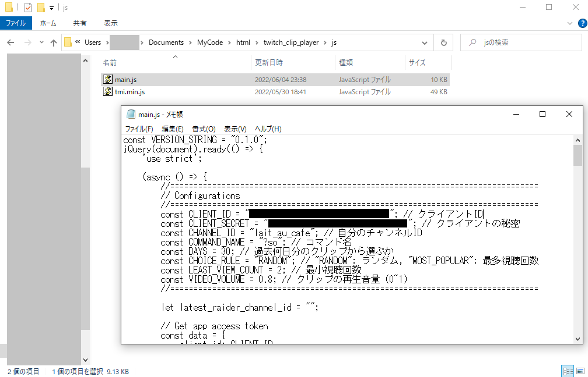
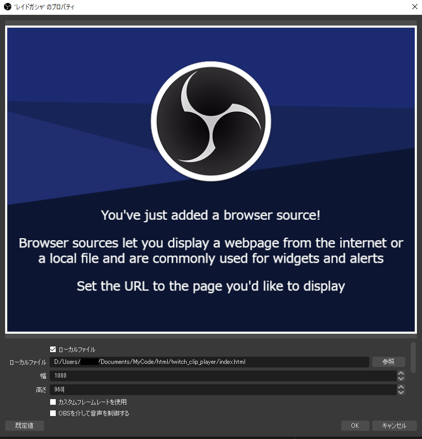

# Twitch Clip Roulette

## 機能

指定したチャンネルのクリップをランダムに１つ選択して再生することができるツールです．
* 直近のレイドであればチャンネル名を指定せずに再生可能
* クリップの選択ルールを「ランダム」「視聴回数の最も多いクリップ」から選択可能
* クリップの選択期間を日単位で指定可能
* 選択されるクリップが最低何回以上視聴されている必要があるかを指定可能

<!-- ## 導入 -->
## 準備
### 1. TwitchAPIキーを取得

公式手順( https://dev.twitch.tv/docs/api/ )のStep1，または以下の記事の「1. 利用登録」を参考にアプリケーションを登録してAPIキーを取得します．名前は「Clip Roulette」，リダイレクトURLは「 http://localhost 」，カテゴリは「Website Integration」あたりで良いと思います．「クライアントID」と「クライアントの秘密」をあとで使います．

Twitch APIを利用してみよう https://qiita.com/pasta04/items/750d71d41e5edd12932b

### 2. 設定とテスト再生

まず js/main.js を適当なエディタで開き，`CLIENT_ID`にクライアントID，`CLIENT_SECRET`にクライアントの秘密，`CHANNEL_ID`に自分のチャンネルIDを入力します．`COMMAND_NAME`，`DAYS`，`CHOICE_RULE`，`LEAST_VIEW_COUNT`は必要に応じて変更してください．

次に index.html を適当なブラウザで開きます．開いた後に**一度ページ内の適当なところをクリックしてから**，自分のチャンネルのチャット欄で `?so チャンネルID` (チャンネルIDには対象とする適当なチャンネルのIDをいれる)とコメントしてクリップを再生します．この時の再生音量を聞いて main.js 内の`VIDEO_VOLUME`を調節してください．

### 3. OBS上に配置

OBS上で新しいブラウザソースを追加します．「ローカルファイル」にチェックを入れて，「参照」からindex.htmlを指定し，「幅」を1080，「高さ」を960程度にしてOKで配置します．その後自分のチャンネルのチャット欄で `?so チャンネルID` とコメントしてクリップを再生し，位置を調節します．